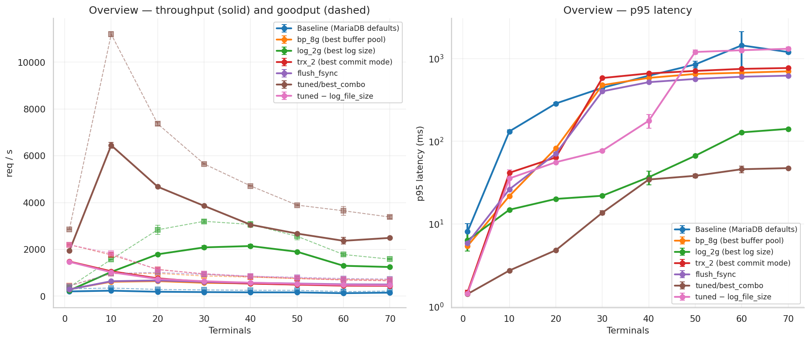
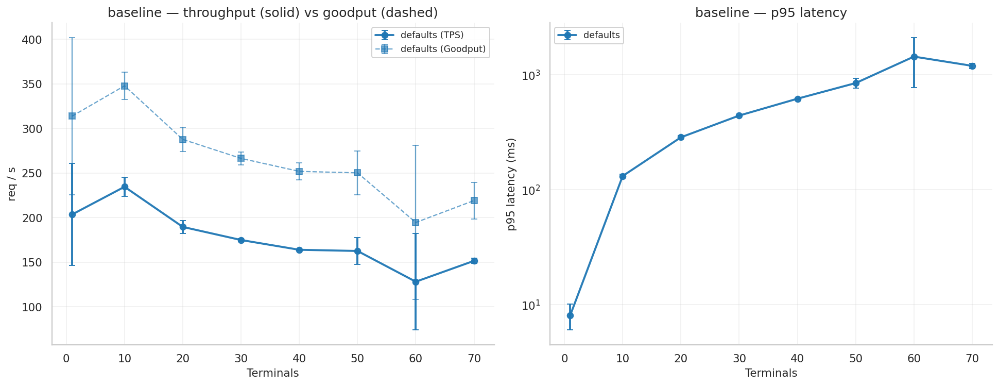
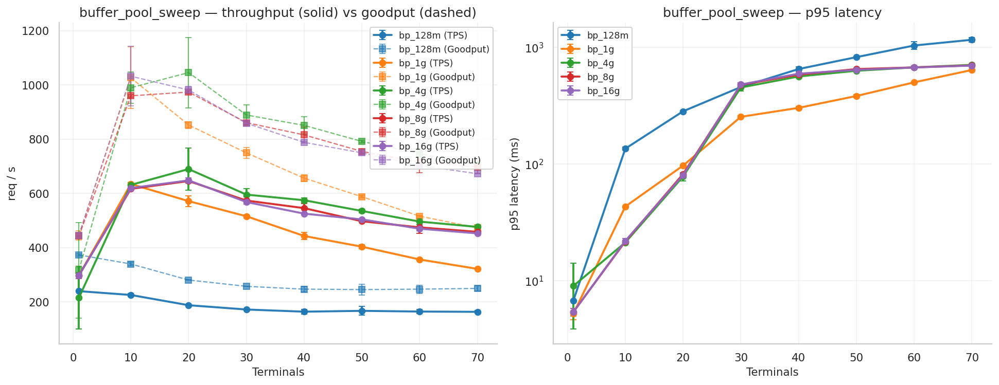
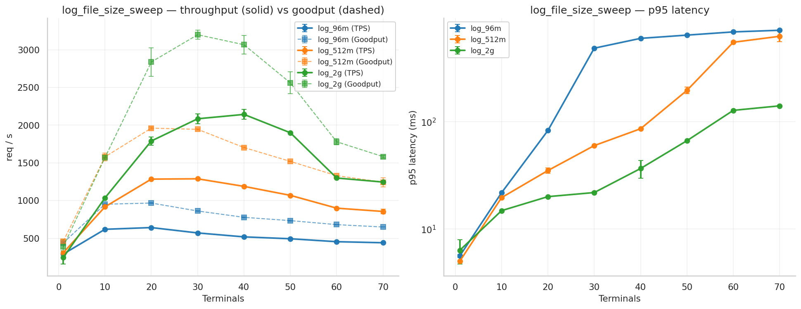
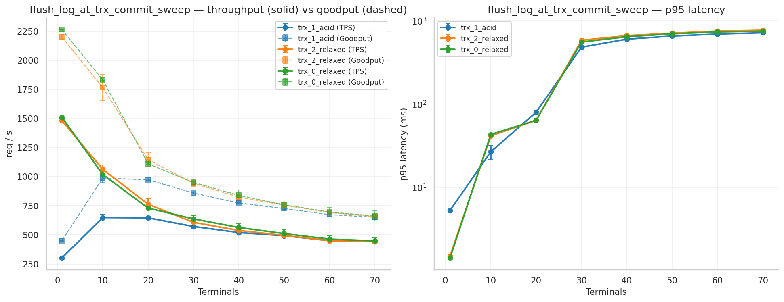
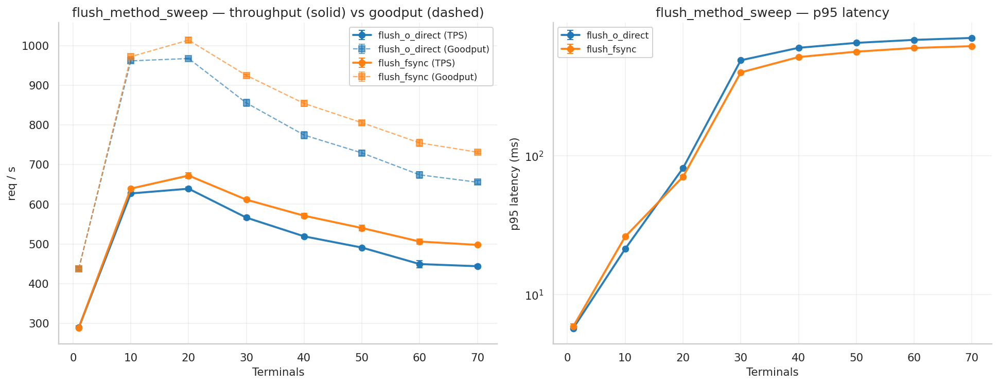
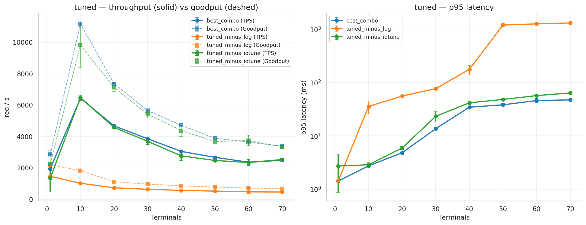

# MariaDB TPC-C — sweep parameters that need a server restart

## Benchmark

BenchBase's TPC-C workload. Five transaction types (`NewOrder`, `Payment`,
`OrderStatus`, `Delivery`, `StockLevel`) in a `45/43/4/4/4` mix against a
wholesale-supplier schema. Steady-state TPS at N concurrent terminals.

| | |
|---|---|
| Scale factor | 200 warehouses (~14 GB on disk) |
| Terminals | 1, 10, 20, 30, 40, 50, 60, 70 |
| Per trial | 90 s warm-up + 180 s measurement |
| Trials per cell | 2, with seed snapshot + MariaDB restart between trials |
| Rate cap | 100 000 req/s |
| Isolation | `READ_COMMITTED` (MariaDB silently downgrades `SERIALIZABLE`) |
| Host | 32-core, 60 GB RAM, single NVMe, Fedora 43 |
| MariaDB | 10.11 in a Docker container |
| BenchBase | `cmu-db/benchbase`, `mariadb` build profile |

A throwaway `_prewarm` variant runs once before the first measured
variant so the OS page cache, InnoDB internals and JVM JIT are in a
representative state when the first measurement starts.

## Task coverage

| Task point | Done as |
|---|---|
| Local MariaDB | `mariadb:10.11` container, full root over `/etc/my.cnf`, server restart between every variant |
| TPC-C | BenchBase `tpcc` workload, default weights `45,43,4,4,4` |
| BenchBase | `cmu-db/benchbase`, `mariadb` profile |
| Tuning | 17 variants across 4 InnoDB parameters; 2 of them need a server restart |
| Parameter effect | Charts in `figures/`, tables below, decomposition table |
| Sensownie | 2 trials per cell, seed restore between trials, throwaway warm-up first, `innodb_vars.json` snapshot per variant |

`<variant>/innodb_vars.json` is a snapshot of every `innodb_%` server
variable taken right after the variant's MariaDB instance came up.
It confirms what `/etc/my.cnf` actually got applied — useful when a
sweep rung looks flat and you want to rule out "the parameter never set".

## Variants

| Variant | `my.cnf` delta from MariaDB 10.11 defaults |
|---|---|
| `baseline/defaults` | none |
| `buffer_pool_sweep/bp_128m` | `innodb_buffer_pool_size = 128M` (default) |
| `buffer_pool_sweep/bp_1g`   | `innodb_buffer_pool_size = 1G` |
| `buffer_pool_sweep/bp_4g`   | `innodb_buffer_pool_size = 4G` |
| `buffer_pool_sweep/bp_8g`   | `innodb_buffer_pool_size = 8G` |
| `buffer_pool_sweep/bp_16g`  | `innodb_buffer_pool_size = 16G` |
| `log_file_size_sweep/log_96m`  | `innodb_log_file_size = 96M` (default), `bp = 4G` |
| `log_file_size_sweep/log_512m` | `innodb_log_file_size = 512M`, `bp = 4G` |
| `log_file_size_sweep/log_2g`   | `innodb_log_file_size = 2G`, `bp = 4G` |
| `flush_log_at_trx_commit_sweep/trx_1_acid`    | `innodb_flush_log_at_trx_commit = 1` (ACID, default), `bp = 4G` |
| `flush_log_at_trx_commit_sweep/trx_2_relaxed` | `innodb_flush_log_at_trx_commit = 2` (write per commit, fsync 1 Hz), `bp = 4G` |
| `flush_log_at_trx_commit_sweep/trx_0_relaxed` | `innodb_flush_log_at_trx_commit = 0` (write + fsync 1 Hz), `bp = 4G` |
| `flush_method_sweep/flush_o_direct` | `innodb_flush_method = O_DIRECT` (default), `bp = 4G` |
| `flush_method_sweep/flush_fsync`    | `innodb_flush_method = fsync`, `bp = 4G` |
| `tuned/best_combo`        | `bp=8G`, `log=2G`, `trx=2`, `O_DIRECT`, `io_capacity=2000/4000`, `log_buffer_size=64M` |
| `tuned/tuned_minus_log`   | `best_combo` with `log_file_size` back to `96M` |
| `tuned/tuned_minus_iotune`| `best_combo` without the `io_capacity` and `log_buffer_size` bumps |

## Charts

Headline overview comparing baseline, best of each sweep, `tuned/best_combo`
and the tuned decomposition variants:



Per experiment (TPS solid, Goodput dashed; p95 latency on log scale):

- 
- 
- 
- 
- 
- 

## TPS at key terminal counts (mean ± 1 std across 2 trials)

| Variant | t=1 | t=10 | t=30 | t=70 |
|---|---:|---:|---:|---:|
| `baseline/defaults` | 204±57 | 235±11 | 175±1 | 152±3 |
| `buffer_pool_sweep/bp_128m` | 240±1 | 226±5 | 172±1 | 163±4 |
| `buffer_pool_sweep/bp_1g` | 297±12 | 635±1 | 516±5 | 322±2 |
| `buffer_pool_sweep/bp_4g` | 215±116 | 632±9 | 596±22 | 477±6 |
| `buffer_pool_sweep/bp_8g` | 298±0 | 617±2 | 574±13 | 458±9 |
| `buffer_pool_sweep/bp_16g` | 297±11 | 620±8 | 568±7 | 453±2 |
| `log_file_size_sweep/log_96m` | 291±6 | 620±7 | 571±1 | 441±0 |
| `log_file_size_sweep/log_512m` | 309±0 | 917±13 | 1289±2 | 856±32 |
| `log_file_size_sweep/log_2g` | 245±88 | 1036±3 | 2085±68 | 1246±7 |
| `flush_log_at_trx_commit_sweep/trx_1_acid` | 302±2 | 649±31 | 572±0 | 445±2 |
| `flush_log_at_trx_commit_sweep/trx_2_relaxed` | 1481±1 | 1064±38 | 608±1 | 442±15 |
| `flush_log_at_trx_commit_sweep/trx_0_relaxed` | 1511±1 | 1019±2 | 637±29 | 448±26 |
| `flush_method_sweep/flush_o_direct` | 289±4 | 627±3 | 566±5 | 444±3 |
| `flush_method_sweep/flush_fsync` | 289±2 | 639±1 | 612±2 | 498±2 |
| **`tuned/best_combo`** | **1941±1** | **6447±126** | **3859±16** | **2491±15** |
| `tuned/tuned_minus_log` | 1469±9 | 1025±3 | 640±31 | 465±21 |
| `tuned/tuned_minus_iotune` | 1343±867 | 6476±162 | 3692±199 | 2536±51 |

## Goodput at key terminal counts

BenchBase's Goodput counts committed transactions. On warmed-up runs
it should be ≤ TPS, but with a non-zero `<warmup>` value it ends up
above TPS because the warmup-period commits leak into the
measurement-period denominator
([benchbase#606](https://github.com/cmu-db/benchbase/issues/606)).
Treat absolute values with that caveat; differences between variants
are still meaningful because every variant has the same warmup.

| Variant | t=1 | t=10 | t=30 | t=70 |
|---|---:|---:|---:|---:|
| `baseline/defaults` | 314±88 | 348±15 | 266±7 | 219±21 |
| `buffer_pool_sweep/bp_128m` | 373±3 | 340±7 | 257±1 | 250±10 |
| `buffer_pool_sweep/bp_1g` | 445±17 | 1027±114 | 750±19 | 473±7 |
| `buffer_pool_sweep/bp_4g` | 317±176 | 990±59 | 889±37 | 704±5 |
| `buffer_pool_sweep/bp_8g` | 443±1 | 960±4 | 861±7 | 698±23 |
| `buffer_pool_sweep/bp_16g` | 445±10 | 1033±110 | 859±5 | 673±0 |
| `log_file_size_sweep/log_96m` | 440±6 | 952±4 | 862±2 | 650±0 |
| `log_file_size_sweep/log_512m` | 460±0 | 1580±53 | 1945±6 | 1244±59 |
| `log_file_size_sweep/log_2g` | 388±98 | 1571±7 | 3199±62 | 1583±16 |
| `flush_log_at_trx_commit_sweep/trx_1_acid` | 450±4 | 988±39 | 860±9 | 651±4 |
| `flush_log_at_trx_commit_sweep/trx_2_relaxed` | 2201±23 | 1767±112 | 943±26 | 657±26 |
| `flush_log_at_trx_commit_sweep/trx_0_relaxed` | 2265±1 | 1833±5 | 950±30 | 663±43 |
| `flush_method_sweep/flush_o_direct` | 438±5 | 961±5 | 855±9 | 656±5 |
| `flush_method_sweep/flush_fsync` | 438±3 | 972±0 | 925±2 | 731±3 |
| **`tuned/best_combo`** | **2861±1** | **11193±111** | **5651±28** | **3382±62** |
| `tuned/tuned_minus_log` | 2197±7 | 1835±1 | 969±40 | 689±34 |
| `tuned/tuned_minus_iotune` | 2258±874 | 9828±1424 | 5421±240 | 3343±16 |

## Where the tuned speedup comes from

The two minus-one-ingredient tuned variants pin down which knob carries
the combined speedup:

* `tuned/tuned_minus_iotune` (drop the `io_capacity` and `log_buffer_size`
  bumps) is **within 1–4 %** of `tuned/best_combo` at every terminal
  count — those knobs are basically decorative on this workload.
* `tuned/tuned_minus_log` (put `log_file_size` back to the 96 M default)
  collapses to **1025 TPS at t=10** vs `best_combo`'s **6447** — a
  6.3× regression. The 8 G buffer pool, `trx_commit=2` and
  `io_capacity` bumps in `best_combo` cannot help when the
  checkpointer is the binding constraint.

Minimum tuned recipe:

```
innodb_buffer_pool_size        = 8G
innodb_log_file_size           = 2G
innodb_flush_log_at_trx_commit = 2
```

## How performance scales past t=10

The overview chart and the per-experiment charts show that for almost
every variant TPS peaks somewhere in `t ∈ {10, 20, 30}` and then
degrades as concurrency grows further. The collapse is mild for the
restart-tuned variants:

| | t=10 (peak) | t=70 | retention |
|---|---:|---:|---:|
| `baseline/defaults`     |   235 |  152 | 65 % |
| `buffer_pool_sweep/bp_8g`  |   617 |  458 | 74 % |
| `log_file_size_sweep/log_2g` | 1036 | 1246 | 120 % (peaks at t=40) |
| `flush_log_at_trx_commit_sweep/trx_2_relaxed` | 1064 | 442 | 42 % |
| **`tuned/best_combo`**  | **6447** | **2491** | **39 %** |

`tuned/best_combo` loses 60 % of its t=10 throughput by t=70 — but
that t=70 number (2491) is still **16× the baseline at t=70** (152)
and **2× any non-tuned variant at t=70**. The tuned recipe stays the
best choice across the full terminal grid.

## Caveats

* Scale 200 (~14 GB) vs the upstream 1 000 (~70 GB).
* 2 trials per cell, so std is a crude estimate. Three cells have one
  outlier trial that bloats the std: `baseline/defaults` t=1
  (204 ± 57), `buffer_pool_sweep/bp_4g` t=1 (215 ± 116), and
  `tuned/tuned_minus_iotune` t=1 (1343 ± 867). The other 133 cells
  agree within 1–10 % between the two trials.
* Goodput artifact above the `<warmup>` value is a known BenchBase
  issue (#606), noted in-line above.
* Local Docker adds one overlayfs hop vs bare-metal.
