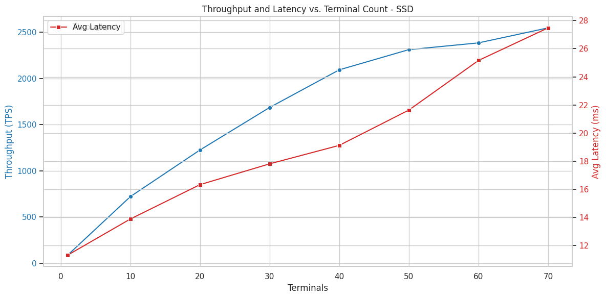
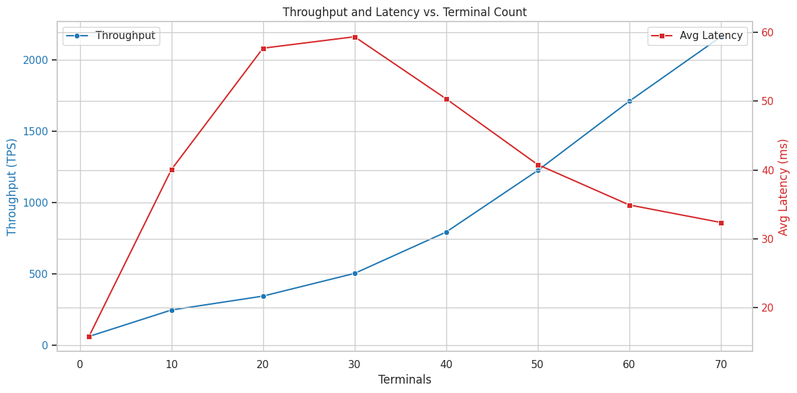
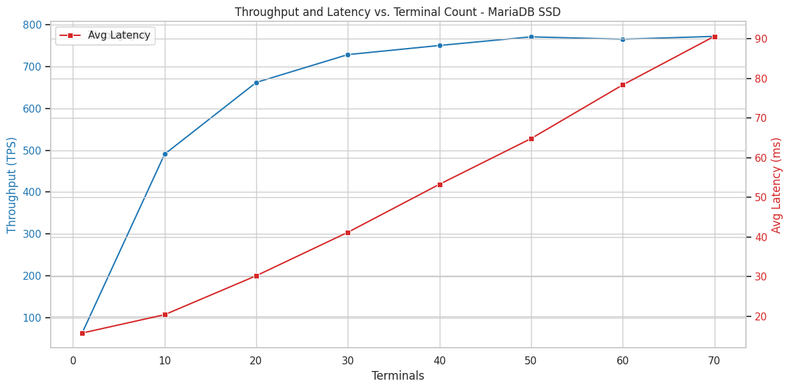
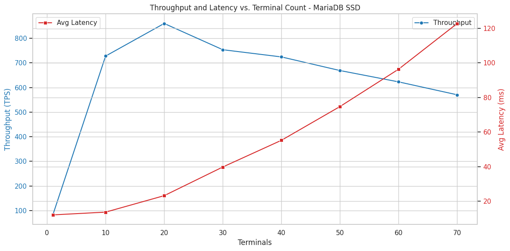

# 1. Introduction

The usual assumption is that a database on an SSD will be much faster than one on HDDs.
In practice, the difference depends on how much data is served from memory, how the
database engine does I/O, and how much time goes into locking rather than disk access.
In this project I wanted to check how big the difference really is on a realistic
workload, and whether the choice of database engine matters more than the choice of drive.

In this report I describe:

1. A comparison of PostgreSQL on an SSD and on a RAID array of HDDs, with 1 to 70
   concurrent terminals.
2. My first round of tests under SERIALIZABLE isolation, and the lock problems I ran into
   when trying to reproduce it (Section 4.1).
3. An attempt to compare PostgreSQL and MariaDB on the same hardware and workload, and
   why their different caching (page cache vs. direct I/O) made a fair comparison
   impossible in my setup.

# 2. Background

**TPC-C** [1] simulates an order-processing system with five transaction types (New-Order,
Payment, Order-Status, Delivery, Stock-Level). The database size depends on the number of
warehouses. The workload has many writes and a lot of contention, so both disk speed and
locking affect the results.

**BenchBase** [2, 3] is a benchmarking tool that supports many databases. It reports
*throughput* (completed requests per second), *goodput* (successfully committed requests
per second) and latency.

**Isolation levels.** PostgreSQL's default isolation level is READ COMMITTED [4]. In
SERIALIZABLE mode it uses Serializable Snapshot Isolation [5], which tracks reads using
SIRead (predicate) locks and aborts transactions that could break serializability. SIRead
locks don't block other transactions, but they take up space in the shared lock table,
whose size is fixed at server start [6, 7].

**I/O and caching.** On paper, the two engines start out equal: both have a small
internal cache by default, 128 MiB for PostgreSQL's `shared_buffers` [8] and for MariaDB's
`innodb_buffer_pool_size` [9]. The difference is what happens on a cache miss, and this
turned out to be the main obstacle to comparing them:

- PostgreSQL uses buffered I/O, so a miss goes through the operating system, which keeps
  the data in its page cache [8]. The page cache has no fixed limit and grows into all
  free RAM on the machine, so PostgreSQL effectively gets a much larger second-level
  cache.
- MariaDB's InnoDB engine uses direct I/O by default [10], bypassing the page cache. It
  only has its 128 MiB buffer pool, and every miss goes to the disk.

# 3. Experimental Setup

- **Hardware:** the faculty's student environment, an x86_64 Debian 13 server with 24
  logical CPUs (as reported by MariaDB) and 128 GB of DDR4 RAM, which hosts other
  students' databases at the same time. It has one data
  directory on an SSD and one on a RAID array of HDDs, and both engines used the same two
  drives.
- **Software:** PostgreSQL 17.8 (before the server restart) and 17.9 (after), MariaDB
  11.8.6.
- **Workload:** BenchBase TPC-C, scale factor 1000 (about 70 GB per database), rate set
  to 100,000 (in practice, no rate limit).
- **Procedure:** I ran the benchmark with 2, 1, 10, 20, 30, 40, 50, 60 and 70 terminals,
  20 minutes each, with a 120 s warmup and a 120 s pause between runs. The 2-terminal run
  went first and only served as the starting point for the database counters, so I don't
  report it. A Python script generated the BenchBase configs and ran everything.
- **Metrics:** throughput, mean and p95 latency from BenchBase, plus database counters
  (`pg_stat_database` [11] for PostgreSQL, InnoDB buffer pool statistics for MariaDB),
  measured as the change during each run.
- **PostgreSQL:** server defaults (`shared_buffers` = 128 MB) except `work_mem` = 128 MB,
  with READ COMMITTED isolation (except in Section 4.1).
- **MariaDB:** server defaults (`innodb_buffer_pool_size` = 128 MiB) in three variants:

  a) Plain defaults. MariaDB ignores BenchBase's isolation setting, so these runs used
     its default, REPEATABLE READ [12].
  b) READ COMMITTED set manually, `sort_buffer_size` and `join_buffer_size` set to
     128 MiB to match PostgreSQL's `work_mem`, and `innodb_io_capacity`/`_max` raised
     from 200/2000 to 2000/4000 [10].
  c) Like (b), but with direct I/O turned off (`innodb_data_file_buffering` and
     `innodb_log_file_buffering` set to ON; in MariaDB 11.8 these replace
     `innodb_flush_method` [10]).

- **Durability:** both engines used their safe defaults (`fsync` and
  `synchronous_commit` on in PostgreSQL, `innodb_flush_log_at_trx_commit` = 1 and the
  doublewrite buffer in MariaDB).

# 4. Results

## 4.1 First round and the SERIALIZABLE problem

In the first round I ran PostgreSQL with SERIALIZABLE isolation and tested the number of
terminals, `random_page_cost` (1.0–6.0) and the CPU cost parameters (`cpu_tuple_cost`,
`cpu_index_tuple_cost`, `cpu_operator_cost`, scaled together from 1/8x to 16x their
defaults) [13]. These runs only kept BenchBase summaries, without database counters.

{width=100%}

On SSD, goodput followed throughput closely and reached 2292 tps at 60 terminals
(Figure 1). On HDD, throughput grew to 1340 tps, but goodput stayed between 113 and 169
tps at every terminal count from 10 upwards, so most HDD transactions were aborted. With
slower I/O, transactions take longer, overlap more, and are more likely to conflict under
SSI [5].

Neither cost parameter had a clear effect. On SSD, throughput stayed within about ±5%
(872–904 tps at 10 terminals for `random_page_cost`, 2115–2309 tps at 60 terminals for
the CPU costs). On HDD, goodput stayed between 116 and 186 tps for all values.

When I came back for a second, more detailed round, I couldn't reproduce the SSD results:
the SSD was now even slower than the HDD. The main bottleneck turned out to be locking:
SERIALIZABLE mode creates many SIRead locks, and they count towards the shared lock limit
[6, 7]. I switched to READ COMMITTED, which got rid of the lock problem, and used it for
all later runs.

## 4.2 PostgreSQL: SSD vs. RAID HDD

Even with READ COMMITTED, the second round was much slower than the first, peaking at
about 300 tps on HDD and 400 tps on SSD. Only after the server was restarted did the
results return to the level of the first round. Table 1 and Figure 2 show these
post-restart results. The configuration was identical before and after the restart,
except that the server was updated from PostgreSQL 17.8 to 17.9. I couldn't find out what
caused the slowdown, so I only mention it here as a caveat.

**Table 1.** PostgreSQL, READ COMMITTED, after the server restart. Throughput in
transactions per second (tps), latency in ms.

| Terminals | SSD tps | HDD tps | SSD/HDD | SSD avg lat. | HDD avg lat. | SSD p95 | HDD p95 |
|---:|---:|---:|---:|---:|---:|---:|---:|
| 1  |   88 |   63 | 1.40 | 11.3 | 15.8 | 29.1 |  45.1 |
| 10 |  721 |  248 | 2.90 | 13.9 | 40.1 | 39.2 | 150.9 |
| 20 | 1225 |  346 | 3.54 | 16.3 | 57.7 | 43.8 | 250.8 |
| 30 | 1685 |  505 | 3.34 | 17.8 | 59.4 | 45.6 | 270.1 |
| 40 | 2092 |  794 | 2.63 | 19.1 | 50.3 | 47.7 | 225.3 |
| 50 | 2310 | 1225 | 1.89 | 21.6 | 40.8 | 54.3 | 159.8 |
| 60 | 2383 | 1710 | 1.39 | 25.2 | 34.9 | 62.9 | 116.8 |
| 70 | 2546 | 2161 | 1.18 | 27.5 | 32.4 | 72.9 | 109.4 |

{width=49%} {width=49%}

**Figure 2.** PostgreSQL after the server restart: throughput (blue) and average latency
(red) vs. number of terminals. Left: SSD. Right: RAID HDD.

SSD throughput grows steadily and starts to level off after 50 terminals, while its
latency grows slowly with load. HDD throughput grows faster and faster, and at 70
terminals it's only 18% behind the SSD. HDD latency even drops after 30 terminals. My
guess is that this is thanks to the RAID array: with more requests waiting at once, more
disks can work in parallel. The cache hit ratio at 70 terminals is practically the same on
both drives (88.5% on SSD, 88.4% on HDD), so the difference comes from how long a cache
miss takes, not how often it happens. The SSD's latency is lower at every load, with p95
latency 1.5–5.7x lower.

## 4.3 PostgreSQL vs. MariaDB

**Table 2.** Best throughput for each configuration (tps, number of terminals in
parentheses).

| Configuration | SSD | HDD |
|---|---:|---:|
| PostgreSQL (after restart) | 2546 (70) | 2161 (70) |
| MariaDB (a): defaults (REPEATABLE READ) | 772 (70) | 62 (30) |
| MariaDB (b): READ COMMITTED + tuned buffers and I/O capacity | 760 (70) | 63 (30) |
| MariaDB (c): tuned, direct I/O off | 860 (20) | — |

{width=49%} {width=49%}

**Figure 3.** MariaDB on SSD: throughput (blue) and average latency (red) vs. number of
terminals. Left: variant (a), defaults. Right: variant (c), direct I/O off.

MariaDB was about 3.3x slower than PostgreSQL on SSD and about 35x slower on HDD.
Variant (b), including the switch from REPEATABLE READ to READ COMMITTED, changed nothing.
Turning off direct I/O in variant (c) made MariaDB faster with few terminals (728 vs. 463
tps at 10 terminals), but it peaked at 20 terminals and then dropped to 570 tps at 70,
below both other variants (Figure 3). On HDD, MariaDB stayed at about 60 tps from 20
terminals onwards, with p95 latency over 3 s at 60–70 terminals.

These numbers should not be read as "PostgreSQL is 3–35x faster than MariaDB". Both
engines had the same small internal cache, but PostgreSQL's misses were often served from
the OS page cache, which could grow into all free RAM on the server. MariaDB's misses went
straight to the disk, and I couldn't enlarge its buffer pool without a server restart.
The server has 128 GB of RAM, so with about 70 GB of data, a large part of PostgreSQL's
database could fit in the page cache, while MariaDB could keep only 128 MiB of it in
memory. This difference in effective cache size is probably the main reason for the gap, especially on HDD, where every cache miss is expensive. Turning off
direct I/O in variant (c) did not make the setups equivalent either, since InnoDB still
manages its own buffer pool and throughput got worse at high load. A fair comparison
would need both engines to have the same amount of memory available for caching.

# 5. Discussion

- **Is the SSD worth it?** With moderate load the SSD gives about 3x the throughput, but
  under high load the HDD array gets within about 20%. The clearest advantage of the SSD
  is its consistently low latency. Whether that's worth the price depends on the expected
  load and on how much latency matters.
- **Page cache and the drive comparison.** PostgreSQL's use of the OS page cache
  probably hides part of the difference between the drives, because `blks_read` also
  counts reads served from the page cache rather than the disk [11]. So some "disk reads"
  in my measurements may never have reached either drive.
- **Page cache and the engine comparison.** Because of the different caching models
  (Section 2), my PostgreSQL vs. MariaDB results compare cache sizes more than they
  compare engines. I can't say from this data which engine is faster. Because the
  server was shared, I also don't know how much of its 128 GB was actually free for the
  page cache during each run, which is another source of noise for PostgreSQL.
- **Tuning mattered less than the environment.** Planner cost parameters and MariaDB's
  I/O settings had little or no effect. The biggest changes came from outside the
  database configuration: aborts and lock exhaustion under SERIALIZABLE, and the
  unexplained slowdown that only went away after the server restart.

# 6. Limitations

- The server was shared with other students' databases, and I ran each configuration only
  once, so the results include noise I couldn't control. The unexplained difference
  before and after the server restart shows this.
- The PostgreSQL vs. MariaDB comparison isn't valid as an engine comparison. Both had
  the same small internal cache, but only PostgreSQL could also use the OS page cache,
  which has no fixed limit. Giving MariaDB a comparable buffer pool requires a server
  restart I didn't have permission for.
- With warmup enabled, BenchBase sometimes reports goodput higher than throughput. This
  is a known issue [14], so I report throughput.

# 7. Future Work

- Run the tests on a server that isn't shared with other users.
- Tune buffer sizes for both engines, especially `innodb_buffer_pool_size`, which needs a
  server restart.
- Repeat each configuration several times to get error bars.

# 8. Conclusion

On this server, PostgreSQL on SSD was up to about 3.5x faster than on RAID HDD with
moderate load, but only about 1.2x faster with 70 terminals. Lower latency was the SSD's
consistent advantage. MariaDB was 3–35x slower than PostgreSQL, but because PostgreSQL
could use the OS page cache and MariaDB could not, this reflects the difference in
available cache rather than in the engines themselves.

# References

[1] Transaction Processing Performance Council. *TPC Benchmark C, Standard
Specification*, Revision 5.11, 2010. <https://www.tpc.org/tpcc/>

[2] D. E. Difallah, A. Pavlo, C. Curino, P. Cudré-Mauroux. "OLTP-Bench: An Extensible
Testbed for Benchmarking Relational Databases." *PVLDB* 7(4), 2013.

[3] BenchBase. <https://github.com/cmu-db/benchbase>

[4] PostgreSQL 17 Documentation. "Transaction Isolation."
<https://www.postgresql.org/docs/17/transaction-iso.html>

[5] D. R. K. Ports, K. Grittner. "Serializable Snapshot Isolation in PostgreSQL."
*PVLDB* 5(12), 2012.

[6] PostgreSQL 17 Documentation. "Lock Management" (`max_locks_per_transaction`,
`max_pred_locks_per_transaction`). <https://www.postgresql.org/docs/17/runtime-config-locks.html>

[7] "Post-mortem: Postgres out of shared memory error."
<https://baida.dev/articles/post-mortem-postgres-out-of-shared-memory-error>

[8] PostgreSQL 17 Documentation. "Resource Consumption" (`shared_buffers`, `work_mem`).
<https://www.postgresql.org/docs/17/runtime-config-resource.html>

[9] MariaDB Documentation. "InnoDB Buffer Pool."
<https://mariadb.com/docs/server/server-usage/storage-engines/innodb/innodb-buffer-pool>

[10] MariaDB Documentation. "InnoDB System Variables."
<https://mariadb.com/docs/server/server-usage/storage-engines/innodb/innodb-system-variables>

[11] PostgreSQL 17 Documentation. "The Cumulative Statistics System" (`pg_stat_database`).
<https://www.postgresql.org/docs/17/monitoring-stats.html>

[12] MariaDB Documentation. "SET TRANSACTION" (isolation levels).
<https://mariadb.com/docs/server/reference/sql-statements/administrative-sql-statements/set-commands/set-transaction>

[13] PostgreSQL 17 Documentation. "Query Planning: Planner Cost Constants."
<https://www.postgresql.org/docs/17/runtime-config-query.html>

[14] BenchBase issue #606. <https://github.com/cmu-db/benchbase/issues/606>
